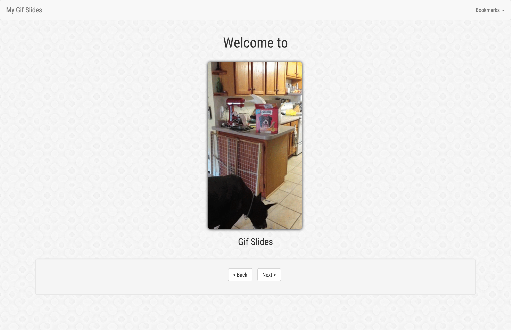

#Gif Slides

Gif Slides is a gif slideshow application that is very easily customizable and quick to start. It is written in AngularJS using Bootstrap, jQuery, and ui-router. It was originally created to showcase an anniversary slideshow but has been refactored for general use.



<br>
##Getting Started

1) Open **scripts/app-data.js**. You should see something like this...

```javascript

var AppData = function() {
    
    this.title = "My Gif Slides";

    this.lines = [
    	{id: 1, top: "Welcome to", bottom: "Gif Slides", top_heading: "h1", bottom_heading: "h3", img: "images/lead.gif"},
    	{id: 2, top: "It's so simple, you couldn't possibly", bottom: "mess up"},
    	{id: 3, top: "Not Amused?", bottom: "Well..I've got one last one for you"},
    	{id: 4, top: "", bottom: "=) Enjoy"},
    ];
    
};

```

2) Change the value of **this.title** to the name of your gif slideshow application.

3) Change the value of **this.lines** to be an array of your captions. See "Creating Lines" for more information.

4) Start up your webserver.

```sh
cd gif_slides
python -m "SimpleHTTPServer" 3000
```

5) Open your browser and go to http://localhost:3000/.

Voilà! You now have a glorious gif slideshow.

<br>
##Creating Lines

In **app-data.js**, there are a few options on how you can create lines in **this.lines**.

The simplest is to just include the **id** of the line. This will simply display the gif at **images/slide1.gif**

```javascript
{id: 1}
```

If you want to add some captions to this, add **top** and/or **bottom**.

```javascript
{id: 1, top: "Here is", bottom: "A Hilarious Gif"}
```

If you want to change the size of these captions from the default (h2), specify an alternative heading as **top_heading** and/or **bottom_heading**

```javascript
{id: 1, top: "Here is", bottom: "A Hilarious Gif", top_heading: "h1", bottom_heading: "h3"}
```

If the default image naming scheme is not to your liking, you can explicitly specify an image for your line 

```javascript
{id: 8, top: "nobody likes", bottom: "a sad puppy", img: "images/sad_puppy.gif"}
```

<br>
###Enjoy =)